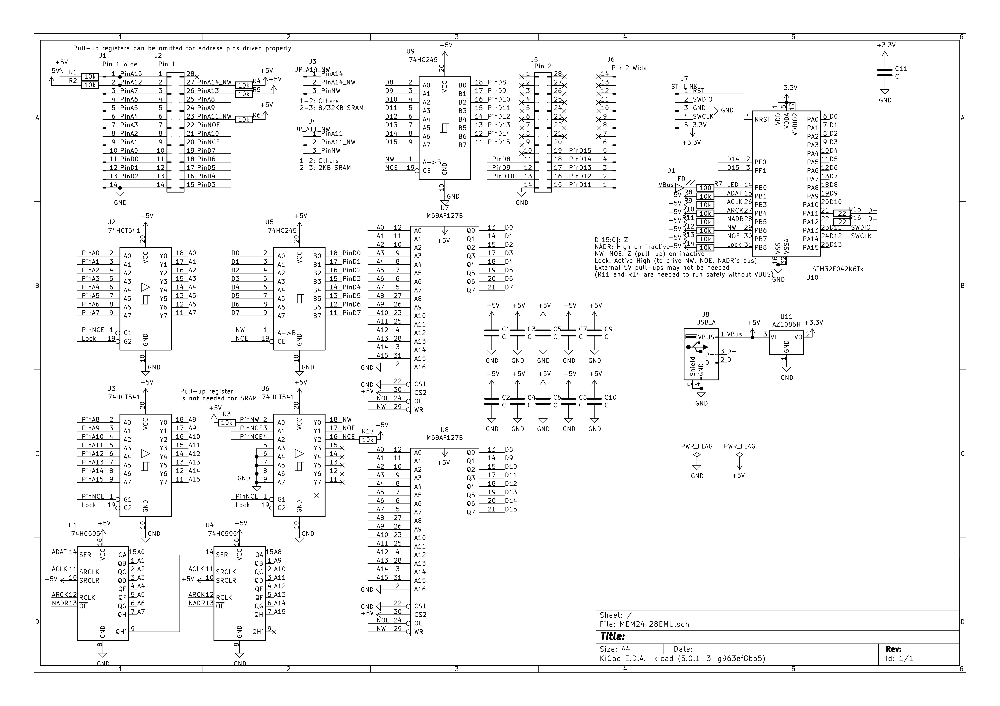

# Mem24-28Emu
Firmware and Tools for SRAM/ROM emulator PCB below.

# Supported SRAM/ROM targets
This can emulate 24, 26, and 28 pins dual SRAM/ROM chips for 16-bits bus access.

## ROM
- 27c16 (2KB)
- 27c32 (4KB)
- 27c64 (8KB)
- 27c128 (16KB)
- 27c256 (32KB)
- 27c512 (64KB)

## SRAM
- 2k x 8-bits
- 8k x 8-bits
- 32k x 8-bits
